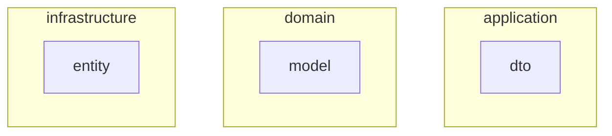
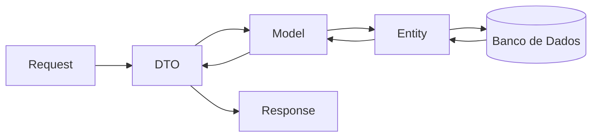

# 🚀 Domain Driven Design com Java e Spring: DTO, Model e Entity na prática

Projeto de exemplo demonstrando na prática como aplicar **Domain Driven Design (DDD)** utilizando **Java 21, Spring Boot, DTO, Model e Entity**, com mapeamento entre camadas usando **MapStruct**.

👉 [Domain Driven Design com Java e Spring: DTO, Model e Entity na prática](https://www.isacaguiar.com.br/blog/ddd-java-spring-dto-model-entity/)

---

# 🚀 Java Records no DDD com Spring: Simplificando DTO e Model na prática

Este projeto também utiliza **Java Records**, o que motivou a criação de um artigo adicional sobre como tornar o código mais simples, seguro e legível.

👉 [Java Records no DDD com Spring: Simplificando DTO e Model na prática](https://www.isacaguiar.com.br/blog/java-record-dto-spring-boot/)

---

## 📌 Sobre o projeto

Este projeto foi criado com o objetivo de demonstrar uma arquitetura simples baseada em DDD, separando claramente as responsabilidades entre:

- **DTO (Data Transfer Object)** → comunicação externa
- **Model (Domain)** → regras de negócio
- **Entity (Infrastructure)** → persistência

Essa abordagem ajuda a manter o domínio isolado, melhorar a manutenção e reduzir acoplamento.

---

## 🏗️ Arquitetura

```
src/main/java
├─ application
│  └─ dto
├─ domain
│  └─ model
└─ infrastructure
   └─ entity
```



---

## 🔄 Fluxo de dados



---

## 🧠 Conceitos aplicados

- Domain Driven Design (DDD)
- Arquitetura em camadas
- Separação de responsabilidades
- Mapeamento entre objetos com MapStruct

---

## 🛠️ Tecnologias utilizadas

- Java 21
- Spring Boot
- MapStruct
- Maven

---

## 📦 Executando o projeto

O projeto pode ser executado através dos testes unitários com JUnit.

### 1. Clonar o repositório

```bash
git clone https://github.com/isacaguiar/website-projects.git
cd website-projects/ddd-java-spring-dto-model-entity
```

### 2. Executar os testes

```bash
mvn test
```

---

## 🔗 Links úteis

### 📖 Artigos

👉 [Domain Driven Design com Java e Spring: DTO, Model e Entity na prática](https://www.isacaguiar.com.br/blog/ddd-java-spring-dto-model-entity/)

👉 [Java Records no DDD com Spring: Simplificando DTO e Model na prática](https://www.isacaguiar.com.br/blog/java-record-dto-spring-boot/)

### 🌐 Site pessoal

👉 [isacaguiar.com.br](https://www.isacaguiar.com.br)
